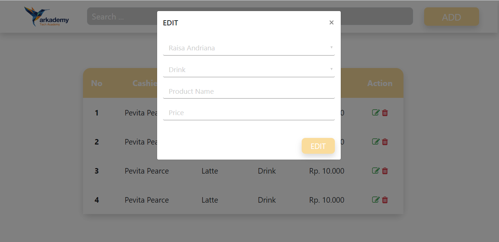

Bahasa yang saya gunakan antara lain :
    1. HTML
    2. JS
    3. CSS

Alat yang digunakan :
    1. Laptop

Software yang dibutuhkan :
    1. Xampp
    2. Visual Studio Code
    3. Chrome

Jawaban nomor 6a
================

Jawaban nomor 6b
================
Home

Add

Delete

Edit

